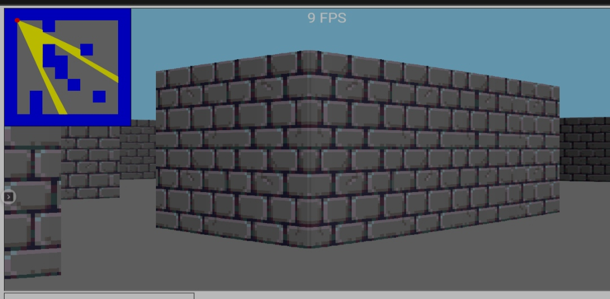

Ray casting is one of 3d rendering method, this method used by many old 3d games like Doom, Wolfenstein 3d, etc.\
Visit https://youtu.be/g8p7nAbDz6Y to learn more about it.

## My Ray Casting Project 

This ray casting engine is poorly coded because this is my first ray casting engine. Made with no framework or library, but pure html5 canvas and javascript\
Try the demo here: https://muraft.github.io/raycasting-test
Features:
- Simple shading
- Texture
- Graphic setting

Cons:
- Very complicated code
- Low performance

### Controls:
- W: Move forward
- A: Move to left
- S: Move backward
- D: Move to right
- Q: Move angle to left
- E: Move angle to right

### Version History

#### First Version
**15th April 2022**\
Very first version, can render the rays perfectly but the shading is very basic, but the problem is the player speed is relative to the minimap size

#### Version 0.2
**16th April 2022**\
Changelog:
- Improved the shading, added depth
- Now the player speed is not relative to the minimap size, so you can resize the minimap and it has no effect to the player speed

#### Version 1.0 (A big update)
**08th May 2022**\
Changelog:
- Code refactor
- Added texture, source: https://www.artstation.com/artwork/3dVnEJ
- Added collision detector to player
- Added graphic setting

#### Version 1.1 (Mobile support)
**15th June 2022**\
Changelog:
- Improved responsiveness for mobile devices
- Added control button for mobile devices
- More graphic settings: toggle fps & minimap
- Little performance improvement
